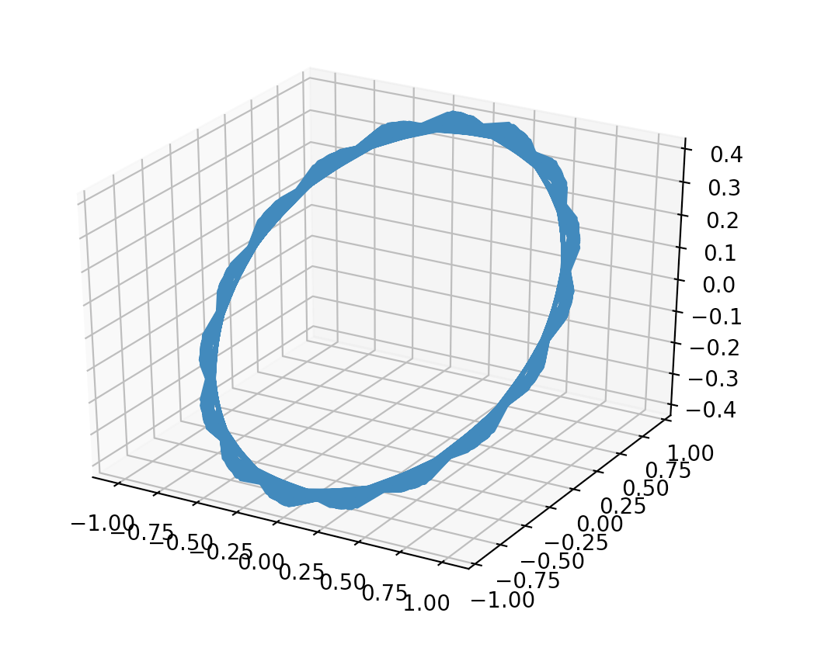

## Friday, September 18th 2020

# Definitions from [wikipedia](https://en.wikipedia.org/wiki/Position_of_the_Sun#:~:text=The%20position%20of%20the%20Sun,circular%20path%20called%20the%20ecliptic.)

Ecliptic Coordinates

n = JD - 2451545.0 

where 
	`n` = the number of days since Greenwich noon, Terrestrial Time, 1 Jan 2000
    `JD` = Julian Date

L = 280.460 degrees + 0.9856474 * n degrees

where `L` = mean longitude of the Sun, corrected for aberration of light

g = 357.528 deg + .9856003 * n deg

where `g` is the mean anomaly of the Sun (of the Earth in its orbit around the Sun)
pretend Sun is orbiting earth

`_lambda` = L + 1.915sing + .02 sin2g

where `_lambda` is the ecliptic longitude of the Sun

the ecliptic latitude of the Sun is nearly `_beta` = 0deg

R = 1.00014 - .01671 * cosg - .00014cos2g

where R is distance of the Sun from the Earth in *astronomical units*

Equatorial coordinates

(`_lambda`, beta, R) form a complete position of the Sun in ecliptic coord system

can be converted to equatorial coord system using `_epsilon`, or the 
obliquity of the ecliptic, also known as *axial tilt*

`_alpha` = arctan(cos(`_epsilon`)tan())

## Results of Converting to Rectangular Coordinates
